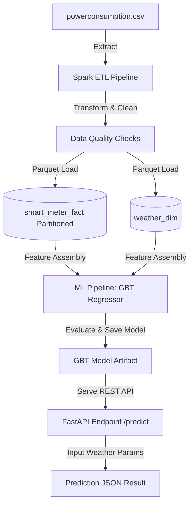

# Case Study 7: Smart Energy Consumption Analytics System using Apache Spark

A national electricity distribution company collects smart meter data, energy consumption records, weather information, and grid performance data. The organization wants to build an **Energy Analytics Platform** to optimize power distribution and predict energy demand.

This repository provides a modular, containerized Spark and Python implementation of the platform, including an ETL pipeline, a machine learning model, containerization with Docker, Kubernetes manifests, a CI/CD workflow, and an interactive FastAPI application.

---

## 🏗️ Architecture



---

## 📂 Directory Structure

```text
CaseStudy7/
├── .github/
│   └── workflows/
│       └── ci-cd.yml          # GitHub Actions pipeline
├── k8s/
│   ├── deployment.yaml        # K8s Deployment Manifest
│   └── service.yaml           # K8s NodePort Service (Port 30070)
├── src/
│   ├── app.py                 # FastAPI predict app
│   └── spark_analytics.py     # Main ETL / ML Spark script
├── tests/
│   └── test_spark_analytics.py# Pytest suite
├── Dockerfile                 # Docker configuration
├── README.md                  # Comprehensive Documentation
├── powerconsumption.csv       # Dataset (copied locally or referenced)
├── output/                    # Parquet ETL outputs (Fact / Dim)
└── images/                    # Visualizations (demand_anomalies.png)
```

---

## 🛠️ Installation & Setup

### Prerequisites
- Python 3.10+
- Java JRE 8/11 (Required for Apache Spark)
- Docker (optional, for containerization)
- Kubernetes/Minikube (optional, for deployment)

### Local Setup
1. Clone the repository and navigate to the project directory:
   ```bash
   cd "d:/CDAC PGCP AI/Module 8 - AI_Computes/CaseStudy7"
   ```
2. Install dependencies:
   ```bash
   pip install pyspark numpy fastapi uvicorn matplotlib pandas pytest
   ```
3. Run the core Spark pipeline:
   ```bash
   python src/spark_analytics.py
   ```
   This will run data extraction, RDD/DataFrame tasks, generate ETL Parquet output in `output/`, train/evaluate ML models, perform anomaly detection, and save a plot under `images/demand_anomalies.png`.

4. Run unit tests:
   ```bash
   pytest tests/
   ```

---

## 🚀 Running the FastAPI Application

You can launch the web application to serve real-time predictions:
```bash
python src/app.py
```
Or with Uvicorn reload:
```bash
uvicorn src.app:app --reload --host 0.0.0.0 --port 8000
```

### Sample Prediction Request
Once the server is running, query the endpoint:
```http
GET http://localhost:8000/predict?Temperature=35.5&Humidity=17.6&WindSpeed=4.9&GeneralDiffuseFlows=59.6&DiffuseFlows=58.8&Hour=19&Month=7
```

### Sample Response JSON
```json
{
  "features": {
    "Temperature": 35.5,
    "Humidity": 17.6,
    "WindSpeed": 4.9,
    "GeneralDiffuseFlows": 59.6,
    "DiffuseFlows": 58.8,
    "Hour": 19,
    "Month": 7
  },
  "prediction": {
    "predicted_demand": 120671.95,
    "unit": "kW"
  }
}
```

---

## 🐳 Containerization using Docker

1. Build the Docker image:
   ```bash
   docker build -t energy-analytics:latest .
   ```
2. Run the Docker container locally:
   ```bash
   docker run -p 8000:8000 energy-analytics:latest
   ```

---

## ☸️ Deployment using Kubernetes

1. Deploy the deployment and service manifests:
   ```bash
   kubectl apply -f k8s/deployment.yaml
   kubectl apply -f k8s/service.yaml
   ```
2. Verify the pods and services are running:
   ```bash
   kubectl get pods -l app=energy-analytics
   kubectl get svc energy-analytics-service
   ```
3. Access the service via NodePort on port `30070`.

---

## 🔄 DevOps CI/CD Pipeline

The `.github/workflows/ci-cd.yml` performs the following checks automatically on every code push/PR:
- **Test Job**: Installs dependencies and runs Python unit tests using `pytest`.
- **Docker Build Job**: Validates the Docker build.
- **K8s Dry-run Job**: Validates the syntax of Kubernetes YAML manifests.

---

## 📊 Machine Learning Model Performance

We trained and evaluated multiple regression algorithms for predicting total power consumption demand based on weather variables:

| Model | RMSE | MAE | R² |
| :--- | :--- | :--- | :--- |
| **GradientBoostedTrees** | **4167.77** | **3055.99** | **0.9398** |
| RandomForest | 4754.51 | 3489.75 | 0.9217 |
| DecisionTree | 4793.36 | 3439.97 | 0.9204 |
| LinearRegression | 10457.17 | 8204.35 | 0.6213 |

- **Anomaly Detection**: Residual threshold is set at $Mean_{residual} + 3 \times StdDev_{residual}$ (~`11558.22`). About `1.79%` of the testing points are identified as anomalies and visualized in `images/demand_anomalies.png`.
